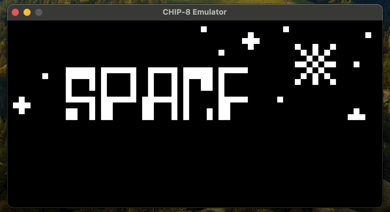
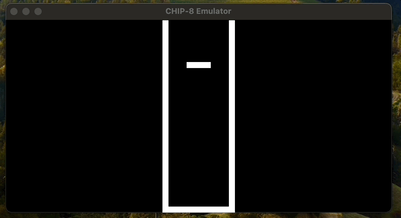

# CHIP-8 Emulator

This is a CHIP-8 emulator written in C++. It uses Raylib for graphics and Glad for OpenGL function loading.
This project was developed over a few days following the CHIP-8 Technical Reference (http://devernay.free.fr/hacks/chip8/C8TECH10.HTM)
and a wonderful blog written by Tobias Langhoff (https://tobiasvl.github.io/blog/write-a-chip-8-emulator/).

This project and it's dependencies can be built using CMake.

Example of Chip-8 Emulator playing Space Jam:

<p align="center">

</p>

## Features

- Emulates CHIP-8 instructions
- Displays graphics using Raylib

## Requirements

- CMake 3.10 or higher
- A C++17 compatible compiler

## Building

To build the project, simply follow these steps:

1. Run CMake to build your Makefile: `cmake  .`
2. Enter `make` in your terminal to build the project to `chip-8`


## Usage

To run the project, please download a valid CHIP-8 ROM (.ch8 file) from https://github.com/kripod/chip8-roms.

```sh

Usage:  ./chip-8 [options] <ROM file>

Options:

--width <width> Set  screen  width (default: 640)

--height <height> Set  screen  height (default: 320)

--fps <fps> Set  frames  per  second (default: 60)

```

## License

This project is licensed under the MIT License - see the LICENSE file for details.

<p align="center">

</p>